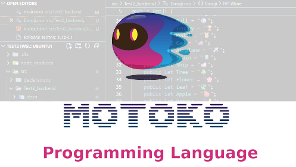

# Motoko Live Coding Session 🤖




Welcome to the **Motoko Live Coding Session** repository! 🚀

This repo contains **everything you need** for a Motoko live coding session:
- Useful tools
- Setup instructions
- Example code

Perfect for learning, experimenting, and building projects in real time with Motoko.

---

## 🔖 Tags
`Motoko` `LiveCoding` `ICP` `InternetComputer` `WebAssembly` `Dfinity` `Tutorials` `CodingSession`


# 🚀 Quick Setup Script for ICP Developer Environment on Ubuntu

## 📌 Instructions

1. Save the script ( _Install_Script.sh )  in a directory of your choice.  
2. Open a terminal and navigate (`cd`) to the directory where the script is located.  
3. Run:

```bash
bash _Install_Script.sh


🟡 Before installing updates, the script might ask you for your root password.
Later on, the script adds paths to your local system environment variables so they’re specific to your user account.

If adding these environment variables fails for some reason, just run the script again.


When installing DFX, press ENTER to proceed with the Default Installer.


 📌 Canister for Query 
https://a4gq6-oaaaa-aaaab-qaa4q-cai.raw.icp0.io/?id=2wpkx-ciaaa-aaaal-qsr5q-cai


